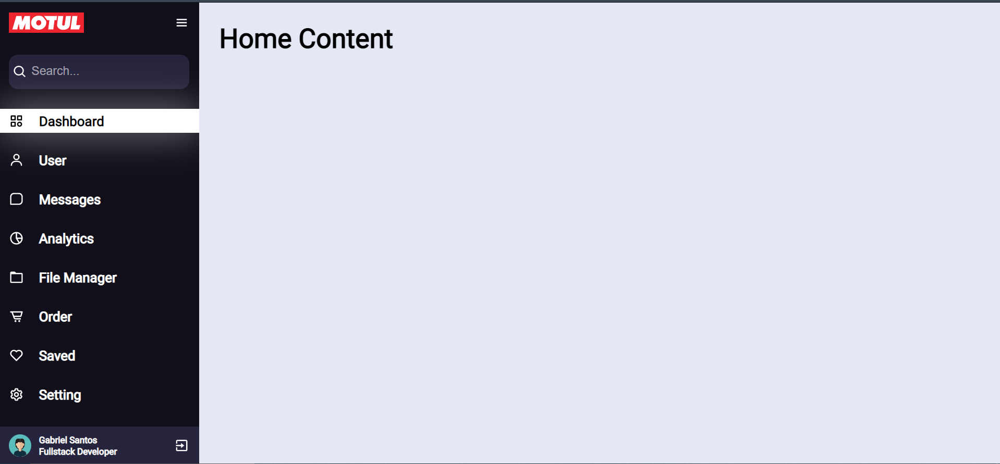

# 💻 | SOBRE APLIACAÇÃO
Menu simples feito com reactJS

# 🚀 | Tecnologias
1. REACTJS
1. HTML
1. JSX
1. CSS3

# :cowboy_hat_face: | MODO DE USAR
```sh
yarn
yarn start
```

# 😱 | RESULTADO


# 📝 | Licença
Esse projeto está sob a licença MIT. Veja o arquivo [LICENSE](README.md) para mais detalhes.
